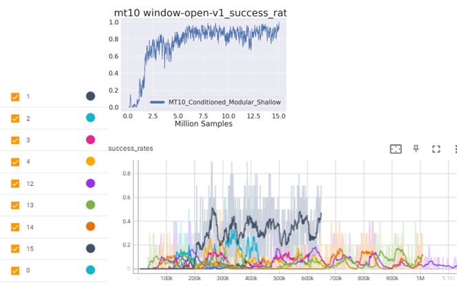

## How to run

#### single-task SAC
```
 python starter/st_sac.py --id MT10_Individual_Tasks --task_id {TASK_ID} --seed {SEED}
```
estimated training time: 1h for 1m total timesteps (rtx3080 gpu)

#### task ids

| task_id    | task_name |
| -------- | ------- |
|0|'reach-v1'| 
|1|'push-v1'|
|2|'pick-place-v1'|
|3|'door-v1'|
|4|'drawer-open-v1'|
|5|'drawer-close-v1'| 
|6|'button-press-topdown-v1'| 
|7|'ped-insert-side-v1'|
|8|'window-open-v1'|
|9|'window-close-v1'|

#### where to look logs

- log (including tensorboard) is generated under 
    ```
    log/MT10_Individual_Tasks/{task_name}/{seed}
    ```
- run tensorboard
    ```
    tensorboard --logdir=log/MT10_Individual_Tasks/{task_name}
    ```

#### where to look for code

- main training loop is located under
```
torchrl/algo/rl_algo.py: train()
```
- experience collecting is done by basecollector, located under
```
torchrl/collector/base.py: train_one_epoch(), take_actions()
```

#### reasons for hyperparameter choices
metaworld v2 dev team's own RL training repo "garage"
pick-and-place-v2: 
https://github.com/rlworkgroup/garage/blob/master/src/garage/examples/torch/mtsac_metaworld_mt1_pick_place.py

#### so far tried
- window-open-v1_sac copy 2...6 -> each have tensorboard id 12...16
- 